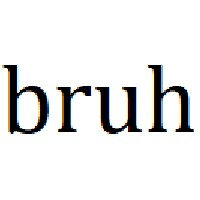

# BruhScript

<p align="center">
	
</p>

#### Programming using bruhs

## Example
##### Adds 2 and 5 and Displays The Result
```
Bruh Bruh bRUH Bruh
Bruh Bruh bRUH Bruh
Bruh Bruh Bruh Bruh
Bru HURb Bruh bRUH
hurB h Bruh Bruh
Bruh Bruh Bruh Bruh
Bruh Bruh Bru HURb
Bruh Bruh Bruh Bruh
Bruh Bruh bRUH hurB
h HURb Bruh!
     
```
###### Output
```7```

[More Examples...](https://github.com/coolymike/BruhScript/Examples)


## Installation
To install, download the repo using:```$ git clone https://github.com/coolymike/BruhScript```<br>
Add To Path using:```$ export PATH=$PATH:/path/to/Bruh```

## Usage
``` $ Bruh filename.bruh```

## Syntax
| Command 	| What it does															|
| ---------	| --------------------------------------------------------------------- |
|  Bru    	| Opens a loop BFE:"[" |
|  h    	| If the cell's value is 0, break the loop. Else, return to loop start 	BFE:"]" |
|  bRUH    	| Moves the current cell one to the right BFE:">" |
|  HURb    	| Moves the current cell one to the left BFE:"<" |
|  Bruh    	| Adds one to the cell's value BFE:"+" |
|  hurB    	| Subtracts one from the cell's value BFE:"-" |
|  Bruh!   	| Print ASCII Charecter of value of current cell BFE:"." |
|  Bruh?   	| Read one Charecter and save the ASCII value to current cell  BFE:"," |

PS: BFE ‣ Brain Fuck Eqiuvalent 
